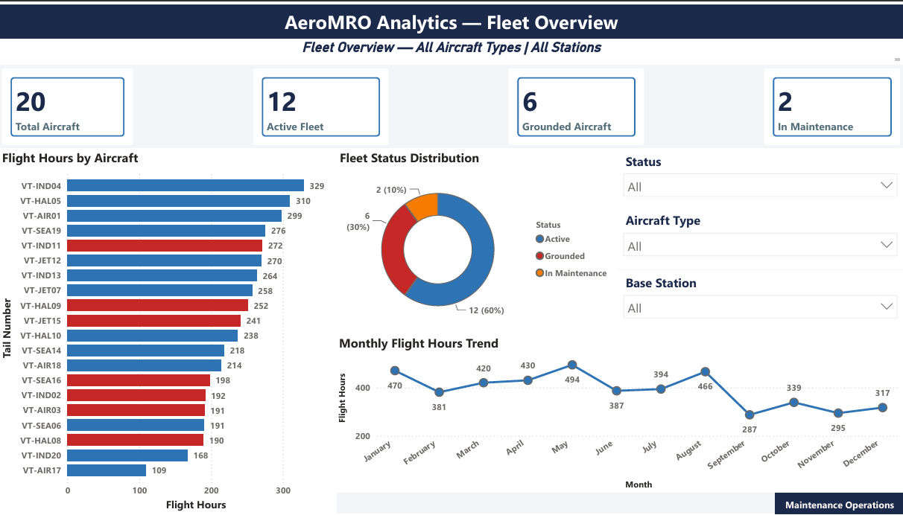
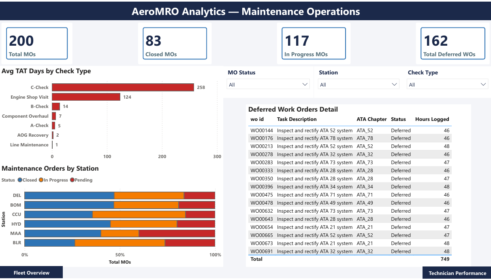
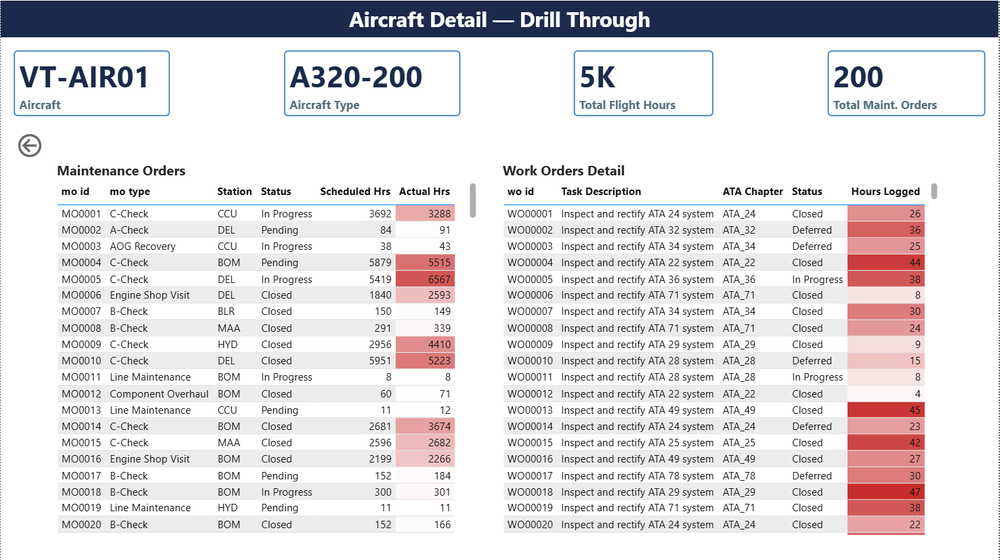
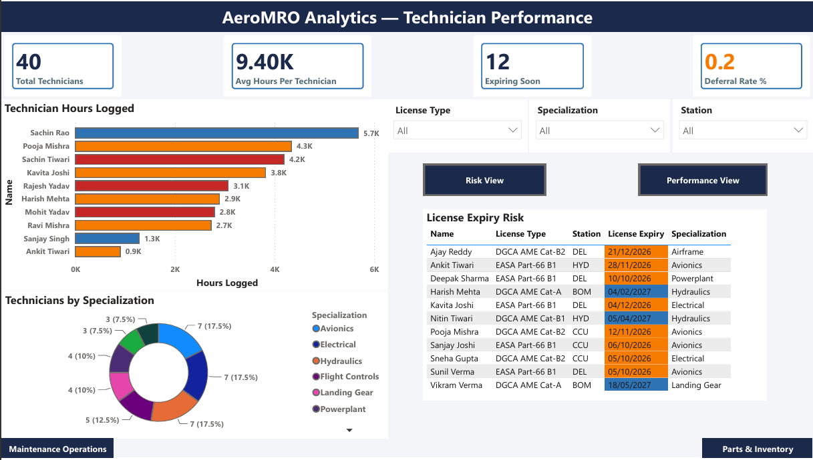
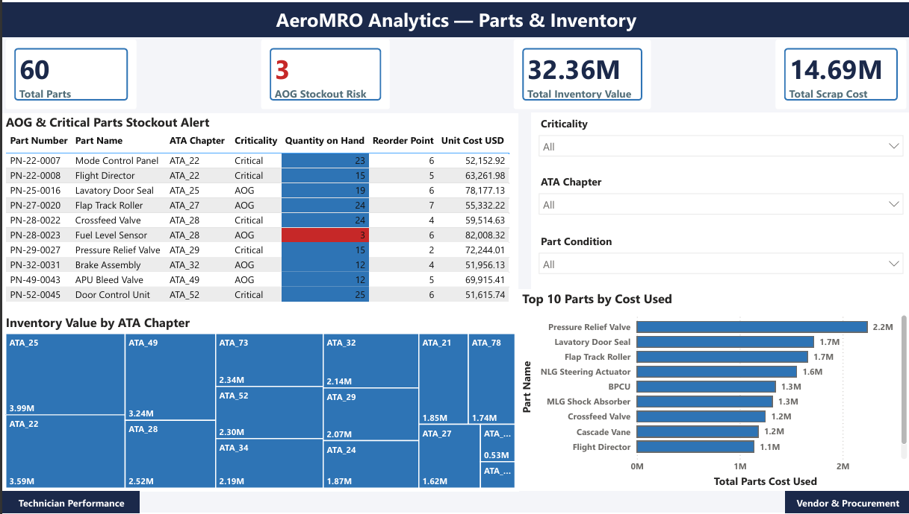
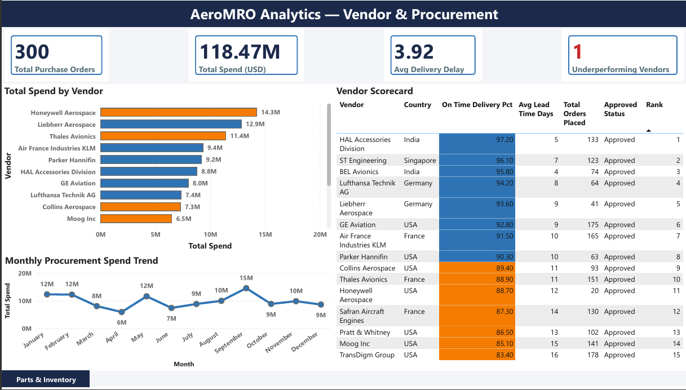
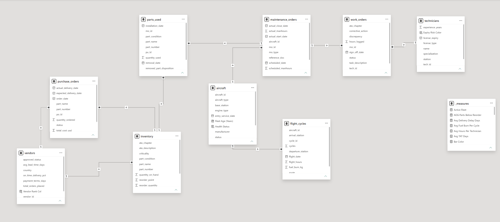

# ✈️ AeroMRO Analytics — Power BI Dashboard

## About This Project

After completing the SQL analysis of MRO operations data across 9 relational tables, I wanted to present the findings in a way that operations managers and non-technical stakeholders could understand at a glance.

This Power BI dashboard connects directly to the MRO database and turns maintenance data into actionable insights — fleet health, check performance, technician risk, inventory stockouts, and vendor reliability all in one place.

This is my most advanced Power BI project to date — built on a custom 9-table star schema with 30+ DAX measures, drill-through navigation, conditional formatting, bookmarks, and What-if parameters.

## Dashboard Pages

**Page 1 — Fleet Overview**
High level fleet KPIs — total aircraft, active fleet, grounded, and in maintenance count. Flight hours by aircraft with conditional formatting (red = critical threshold). Fleet status distribution and monthly flight hours trend with aircraft type and station filters.

**Page 2 — Maintenance Operations**
Maintenance order performance across all check types — A/B/C checks, Engine Shop Visits, and AOG recoveries. TAT analysis by check type, station workload breakdown, and a filtered table of all deferred work orders with ATA chapter classification.

**Drill Through — Aircraft Detail**
Hidden page triggered by right-clicking any aircraft on the Fleet Overview page. Shows that aircraft's full maintenance order history, scheduled vs actual manhours comparison, and work order detail with hours logged heatmap. Back button returns to previous page.

**Page 3 — Technician Performance**
AME performance across 40 technicians — top 10 by hours logged, specialization breakdown, and license expiry risk table. Amber conditional formatting flags licenses expiring within 12 months. Bookmark buttons toggle between Performance View and Risk View.

**Page 4 — Parts & Inventory**
Inventory health across 60 parts — AOG stockout risk, total inventory value, and scrap cost. Treemap shows value concentration by ATA chapter. Critical parts table flags any AOG or Critical parts at or below reorder point in red — Fuel Level Sensor currently at qty 3 against reorder point of 6.

**Page 5 — Vendor & Procurement**
Vendor scorecard ranking all 15 vendors by on-time delivery percentage. Total spend by vendor with color coding — blue for ≥90% on-time, orange for underperforming. Monthly procurement spend trend and full scorecard table ranked 1 to 15.

## Data Model

9-table star schema connecting fleet, maintenance, technician, parts, and procurement data.

## DAX Measures Used

- `CALCULATE` — filtered aggregations across all pages
- `VAR…RETURN` — Avg Fuel Burn, Avg TAT Days, Avg Delivery Delay
- `RANKX` — Technician performance rank, Vendor scorecard rank
- `SUMX` — Inventory value calculation, scrap cost
- `DATEDIFF` — TAT calculation from start to close date
- `SELECTEDVALUE` — Dynamic title on Fleet Overview page
- `DIVIDE` — Safe division with blank handling throughout

## Key Findings

- 3 AOG parts below reorder point — Fuel Level Sensor critically low at qty 3
- C-Checks averaging 258 days TAT — highest of all check types
- 162 deferred work orders across all stations
- 12 technician licenses expiring within 12 months
- TransDigm Group only underperforming vendor at 83.4% on-time delivery
- Honeywell Aerospace leads total spend at $14.3M

## Power BI Features Used

- Star schema data model — 9 tables with defined relationships
- Power Query — data type corrections, custom columns, null handling
- DAX calculated columns and measures
- Conditional formatting using Field Value method
- Drill Through — Aircraft Detail hidden page
- Bookmarks — Performance View and Risk View toggle
- Dynamic Title — updates based on slicer selection
- Navigation Buttons — Previous and Next on all pages
- Published to Power BI Service

## Tools Used

- Power BI Desktop
- MySQL — data source and SQL analysis
- 9 tables | 200 MOs | 694 Work Orders | 300 Purchase Orders | 2025

## Related Project

🔍 [SQL Analysis Repository](https://github.com/gautamgpt311/aeromro-sql-analysis)
👉 [View Live Dashboard](https://app.powerbi.com/links/awIbx_qWZK?ctid=56c1d497-700b-49cf-8f8d-3dd6b20d522f&pbi_source=linkShare)
